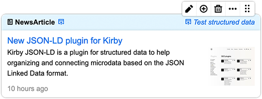

# Kirby JSON-LD

> Advanced SEO for structured data

Kirby JSON-LD is a plugin for structured data to help organizing and connecting microdata based on the JSON Linked Data format ([JSON-LD](https://json-ld.org/)).



*Blueprint example of data type NewsArticle*
****

## Data types
Currently the following data types are available. More to come soon (or on [request](https://github.com/chrfickiger/kirby-jsonld/issues)).

- [NewsArticle](#NewsArticle)
- [FAQPage](#FAQPage)

****

## How to use Kirby JSON-LD
1. Download the plugin and put in your Kirby plugin directory (e.g. `site/plugins/`)
2. Add your global publisher info to the Kirby config file (`site/config/config.php`) [recommended]
```
'chrfickinger.jsonld-for-kirby' => [
    'publisher' => [
    'type' => 'Organization/Person',
    'name' => 'Name',
    'logo' => 'Logo URL'
    ]
]
```
3. Add the block `jsonld` to a blueprint of your choice (e.g. `site/blueprints/pages/default.yml`). This allows to use as many blocks as needed on the page.
```yaml
jsonld:
    extends: jsonld
```
4. Add the following snippet to your output template or footer snippet. (e.g. `site/templates/default.php` or `site/snippets/footer.php`)
```php
<?php snippet('jsonld'); ?>
```

****
## Collection of types

### NewsArticle
Use this type, if your content is an article page about news, blog or sports. The following code snippet is automatically generated by the plugin by using type `NewsArticle`. The fields in the [square brackets] in the example are replaced by Kirby's content fields.
```html
<script type="application/ld+json">
    {
      "@context": "https://schema.org",
      "@type": "NewsArticle",
      "headline": "[HEADLINE]",
      "description": "[DESCRIPTION]",
      "image": [
        "[URL]"
      ],
      "datePublished": "[DATE]",
      "author": {
        "@type": "Person",
        "name": "[NAME]"
      },
      "publisher": {
        "@type": "Organization",
        "name": "[NAME]",
        "logo": {
          "@type": "ImageObject",
          "url": "[URL]"
        }
      }
    }
</script>
```
*More information about the data type [NewsArticle.](https://developers.google.com/search/docs/data-types/article)*

### FAQPage
Use this type, if your page contains a list of questions and answers pertaining to a particular topic. The following code snippet is automatically generated by the plugin by using type `FAQPage`. The fields in the [square brackets] in the example are replaced by Kirby's content fields.
```html
<script type="application/ld+json">
    {
      "@context": "https://schema.org",
      "@type": "FAQPage",
      "mainEntity": [{
        "@type": "Question",
        "name": "[QUESTION]",
        "acceptedAnswer": {
          "@type": "Answer",
          "text": "[ANSWER]"
        }
      }, {
        "@type": "Question",
        "name": "[QUESTION]",
        "acceptedAnswer": {
          "@type": "Answer",
          "text": "[ANSWER]"
        }
      },
        ...
    }
</script>
```
*More information about the data type [FAQPage](https://developers.google.com/search/docs/data-types/faqpage).*

****

## License
This plugin is completely free and published under the MIT license. However, if you are using it in a commercial project and want to help me keep up with maintenance, please consider [making a donation of your choice](https://paypal.me/chrfickinger) or purchasing your license(s) through [my affiliate link]().

****

## Credits

- [Christian Fickinger](https://github.com/chrfickinger)
